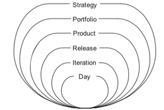
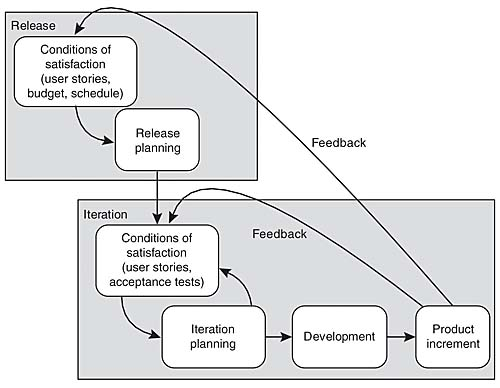

# Introduction To Agile Development
Agile Software Development | Session 1-2

## Agile Manifesto Value
Agile movement dimulai pertama kali setelah dibentuknya Agile Manifesto pada Februari 2001, berikut ini isinya :
-  **Individuals and interactions over processes and tools**. Artinya kita tidak sepenuhnya mengikuti proses (tidak seperti waterfall). Dalam agile kita memikirkan individualnya dan cara berinteraksinya. 
- **Working software over comprehensive documentation**. Artinya kita harus menganalisis software sampai sejelas mungkin yang menghasilkan doumentasi yang komprehensif, tidak hanya fokus membuat software saja.
- **Customer collaboration over contract negotiation**. Artinya kita mengedepankan kolaborasi dengan customer, semisal tiap release cycle kita akan memberikan produk kepada customer dan meminta feedback akan produk tersebut.
- **Responding to change over following a plan**. Artinya kita berusaha untuk merespons/beradaptasi terhadap sebuah perubahan, daripada sekedar mengikuti rencana.

## Apa itu Agile?
Agile merupakan sebuah *mindset* yang mengajarkan kita untuk bisa beradaptasi terhadap sebuah perubahan. Ketika kita menghadapi sebuah ketidakpastian, lakukan sesuatu yang menurutmu bisa berhasil, lalu kita harus mendapatkan feedback untuk mengetahui apakah pendekatan tersebut efektif, lalu lakukan perubahan untuk memperbaiki hasil/proses tersebut.

## 12 Principles Of Agile Manifesto
Kalau Agile Manifesto Value merupakan singkatannya kalau 12 Principles Of Agile Manifesto merupakan prinsip lengkapnya. [Baca disini bos, udah jelas lah gk perlu dijelasin lagi](https://agilemanifesto.org/principles.html).

## Agile is People Oriented Rather Than Process Oriented
Dalam Agile, individu merupakan faktor paling penting yang menentukan kesuksesan dalam mendevelop sebuah sofware. Agile tidak hanya mementingkan skills tiap individu tetapi semua aspek kemanusiaan mereka. Bagaimana anggota dalam tim dapat bekerja bersama, seberapa banyak permasalahan yang mereka alami dan bagaimana cara mereka dapat speak up ketika terjadi permasalahan.

## Agile Project Approach
- **Work as a team**. Individu harus bisa bekerja sebagai team.
- **Work in short iteration**. Dalam mendevelop sebuah fitur dalam sofware, jangan pernah menunda-nunda dalam mendevelopnya, harus terdapat target kapan sebuah fitur selesai.
- **Delivering each iteration**. Tiap iterasi harus ada sesuatu yang jadi.
- **Focus on Business Priority**. Fitur harus sesuai dengan kebutuhan customernya/target bisnisnya.
- **Inspect and adapt**. Harus bisa beradaptasi terhadap sebuah perubahan.

## Onion Agile Planning

- **Strategy**, kita harus memastikan project yang kita buat sesuai dengan visi dan tujuan dari company.
- **Portfolio**, kita harus memikirkan project jenis apa saja yang akan diambil.
- **Product**, kita memikirkan fitur utama dari sebuah produk.
- **Release**, kita memikirkan kapan fitur akan dirilis.
- **Iteration**, kita menentukan akan melakukan apa tiap iterasinya.
- **Day**, kita menentukan tiap harinya akan melakukan apa.

### Condition Satisfaction

## Plan Driven Development

Salah satu contoh plan driven development adalah waterfall. Plan driven development dapat bekerja dengan baik apabila kita menyelesaikan permasalahan terdefinisikan dengan baik, predictable dan kecil kemungkinan untuk mengalami sebuah perubahan.

### Plan Driven Development Smell Bad
Pengembangan Software yang terlalu bergantung pada rencana sering kali tidak efektif dan tidak dapat beradaptasi terhadap sebuah perubahan yang terjadi dalam proses pengembangan.

## Why Agile Won & Why Agile Lose
Agile dapat berhasil karena berfokus pada fleksibilitas dan kolaborasi yang memungkinkan tim untuk beradaptasi terhadap perubahan. Namun, agile dapat gagal ketika kita tidak memahami filosofi yang mendasarinya, sehingga implementasinya menjadi tidak efektif.

## TLDR
Agile merupakan bagaimana kita beradaptasi terhadap sebuah perubahan. Bagaimana kita menghadapi sebuah permasalahan yang muncul dalam development.
