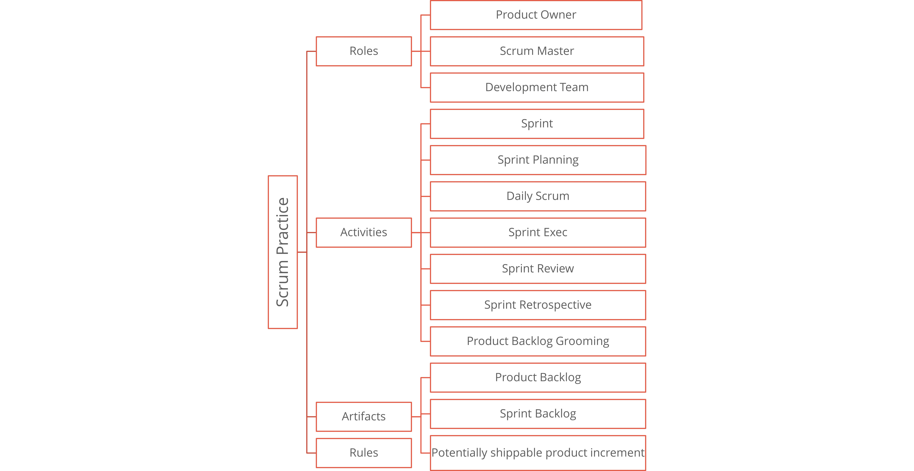

# Agile Development Models
Agile Software Development | Session 3-4

## How To Be Agile?
Setiap tim memiliki caranya tersendiri untuk bekerja atau berproses. Untuk menjadi Agile, kita harus mengubah semua cara kerja atau berproses agar merefleksikan filosofi Agile.

## Road To Mastery

### Follow the rules
Lakukan agile secara menyeluruh -> Refleksikan apa yang bisa kita improve -> Pelajari kelemahan kita -> REPEAT
### Break the rules
Amati apa yang kira-kira bisa diganti dan diimprove -> Lakukan perubahan tersebut -> Lakukan secara menyeluruh -> REPEAT
### Ignore the rules
Lakukan apa yang menurutmu lebih baik -> Amati hasilnya -> REPEAT

## Types of Agile Development
Kita membutuhkan metodologi untuk bisa menerapkan Agile. Maka dari itu terbentuklah Agile Development Models yang merupakan tahapan-tahapan untuk mendevelop sebuah software. Berikut tipe development models :
- Scrum
- eXtreme Programming (XP)
- Feature Driven Development
- Dynamic System Development Method
- Adaptive Sofware Development
- Crystal
- Lean Software Development

## Scrum
### Definition of Scrum
Scrum merupakan framework dalam Agile yang membantu individu, team dan organisasi menyelesaikan permasalahan yang kompleks dengan cara yang fleksibel dan beroientasi pada nilai-nilai yang dihasilkan. Framework scrum tidak berfokus penuh terhadap aturan, tetapi lebih sebagai panduan agar tim bisa bekerja dengan efektif dan dapat berkolaborasi dengan baik.
### Fundamental and pillars
Scrum ditemukan berdasarkan **empiricism** dan **lean thinking**.
**Empiricism** artinya pengetahuan didapatkan dari pengalaman dan membuat keputusan berdasarkan apa yang diamati.
**Lean Thinking** artinya kita harus berfokus pada hal yang penting saja.
Scrum menggunakan pendekatan iteratif dan inkremental untuk memastikan hasil yang bagus dan mitigasi resiko yang lebih baik. Scrum itu membangun sesuatu sedikit demi sedikit, bukan langsung sekaligus. Tim bekerja dalam siklus pendek (*Sprint*), jadi bila ada sesuatu yang perlu diubah bisa cepat diperbaiki tanpa mengulang semuanya dari awal. Ini membantu tim bekerja dengan lebih terencana dan mitigasi resiko menjadi lebih baik.

### Scrum Practice

#### Scrum Roles
##### Product Owner
Product Owner bertanggung jawab untuk memaksimalkan hasil dari sebuah produk, dengan cara menentukan fitur apa yang akan dimasukkan kedalam produk dan memprioritaskan backlog produk. Selain itu product owner harus memastikan semuanya berjalan sesuai rencana dan bertindak sebagai jembatan antara tim developer dan pengguna. 
##### Scrum Master
Scrum Master bertanggung jawab untuk memastikan tim developer bekerja dengan efektif sesuai dengan prinsip Scrum. Scrum Master membantu semua individu dalam team untuk memahami teori scrum dan praktiknya.
##### Development Team
Development Team bertanggung jawab untuk mengembangkan produk. Mereka bertugas untuk mengembangkan fitur, memperbaiki bug dan memastikan hasil akhirnya sesuai dengan kebutuhan pengguna. Tim ini harus bisa bekerja secara kolaboratif untuk menyelesaikan tugas yang ditetapkan dalam Sprint.

#### Scrum Events
##### Sprint
Sprint merupakan inti dari Scrum, Sprint merupakan sebuah periode kerja tetap dimana tim berfokus untuk mengubah ide yang ada menjadi hasil nyata. Selama proses Sprint, tim harus bisa menjaga tujuan dan kualitas tanpa mengubah rencana secara drastis agar tetap efektif dan konsisten.
##### Daily Scrum
Daily Scrum merupakan rapat singkat (Stand Up) harian yang dilakukan oleh tim developer dalam Scrum. Hal ini bertujuan untuk memeriksa progres terhadap Sprint Goals dan menyesuaikan rencana kerja bila diperlukan.
##### Scrum Artifacts
Scrum Artifacts merupakan hasil dari Scrum. Scrum Artifacts merupakan representasi dari pekerjaan atau nilai yang sedang dikerjakan oleh tim. Berikut tiga artifacts utama :
1. Product Backlog menghasilkan product goal
2. Sprint Backlog menghasilkan sprint goal
3. Increment (Hasil kerja dalam 1 sprint) menghasilkan Definition Of Done (Hasil kerja yang bisa digunakan)

#### Scrum Framework

### Kanban

Pertama kali di develop di toyota, Kanban merupakan alat manajemen alur kerja visual yang berfungsi untuk mengoptimalkan alur kerja. 
#### Key Components Of Kanban Board
- **Column** Berisikan workflow stages (e.g Backlog, Development, Testing, Done)
- **Cards** Berisikan tugas tiap individual. Biasanya berisi *Task Title*, *Description*, *Asignee*, *Due Date*
- **WIP (Work In Progress) Limits** Berisikan tugas maksimum yang diperbolehkan dalam Column agar tidak terjadi overload
- **Due Date** Untuk mengorganasikan tugas berdasarkan kategori (e.g Urgent, Features, Bugs)

## eXtreme Programming (XP)
Merupakan metode agile yang menekankan pada kepuasan pelanggan dengan memberikan software secara bertahap dan sesuai dengan kebutuhan pelanggan. XP memungkinkan tim untuk merespons perubahan kebutuhan pelanggan dengan cepat. Metode ini cocok untuk proyek yang memiliki kebutuhan teknis yang kompleks.

## Feature Driven Development
Merupakan metode agile yang berfokus pada fitur sebagai unit utama pengembangan software. Setiap bagian dalam software dikembangkan secara bertahap. Metode ini lebih sesuai digunakan untuk proyek berskala besar dengan struktur yang jelas.

## Dynamic System Development Method
Merupakan metode agile yang menekankan pada kecepatan pengembangan software dengan mengutamakan keterlibatan pengguna dalam pengembangannya. Biasanya metode ini digunakan dalam proyek yang memiliki deadline yang ketat.

## Adaptive Software Development
Merupakan metode yang sangat fleksibel dan berorientasi pada perubahan, sehingga cocok untuk proyek yang sering mengalami pergeseran kebutuhan atau masih dalam tahap eksplorasi.

## Crystal
Merupakan metode yang disesuaikan berdasarkan ukuran sebuah tim. Cocok untuk tim kecil yang membutuhkan fleksibilitas dalam pengelolaan proyek.